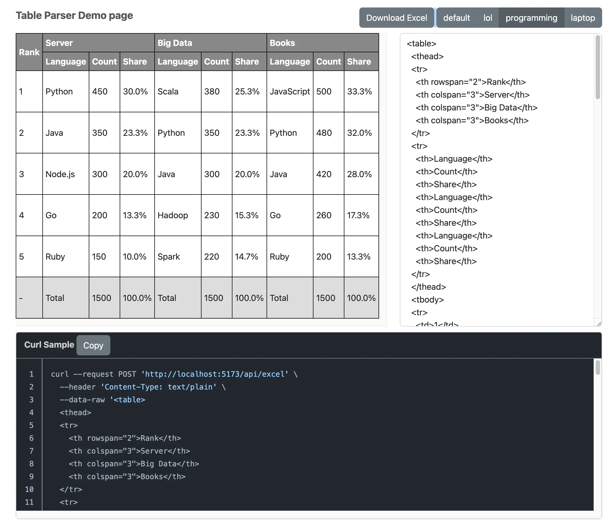

# Table Parser

This application convert HTML table into Excel files



## Features

- It helps to parse HTML table into Excel file
- Even if tables have colspan or rowspan it will convert regarding the colspan and rowspan, and that's why I started
  this project

## How to

```
./gradlew clean build
java -jar ./table-parser-api/build/libs/table-parser-api.jar
npm install -C front && npm run dev -C front
```

TODO: Docker support
